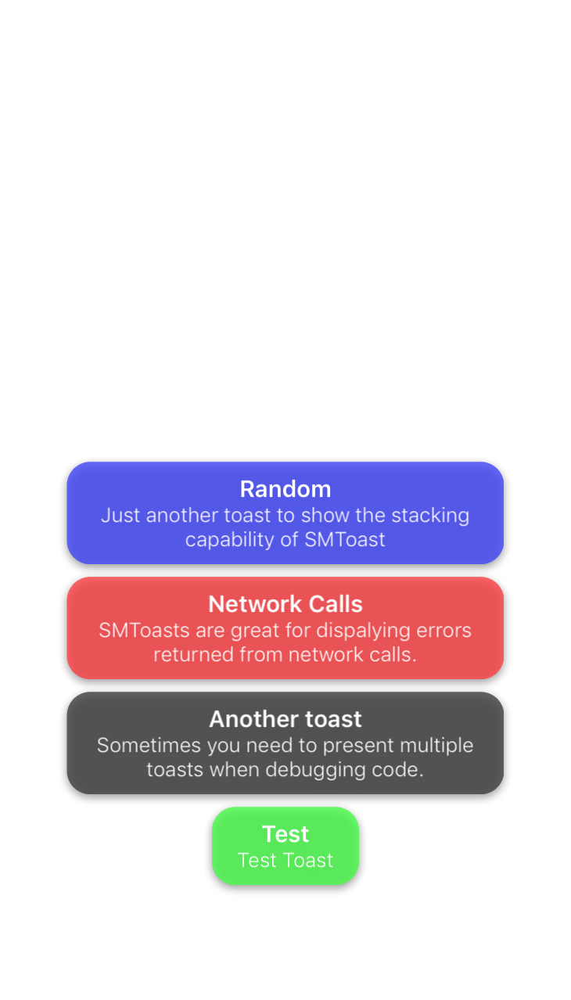

# SMToast

[](https://travis-ci.org/mandrusiaks/SMToast)
[](http://cocoapods.org/pods/SMToast)
[](http://cocoapods.org/pods/SMToast)
[](http://cocoapods.org/pods/SMToast)

SMToast provides a fast and simple way to display a short message. It works great for showing error messages during development, or notifying users of successful actions. SMToasts will present one on top of the next, as long as they will fit on the screen. If they cannot fit, the leftover SMToasts are added to the "onHold" queue where they will be presented in the position of the most recently expired toast. SMToast's are draggable and can be moved around the screen; perfect for times when you need to move a toast that overlays an important piece of information in your app.

SMToast now allows users to flick away a toast whenever they want. This way, if any toasts are bothering the user and are still in the process of fading away, they have a fun, interactive way of dismissing the toast. Another new feature is being able to enable/disable the onHoldQueue (disabled by default). 

*Important*: Now by default, SMToast has a new value ```isActiveQueueEnabled``` set to false. This means only one toast will be displayed on the screen until the most active toast has been completely faded out. This avoids users from spamming toasts and stacking them all the way up the screen. However, you can easily enable this functionality by setting ```isActiveQueueEnabled = true``` (ideally in your AppDelegate).

To change ```isActiveQueueEnabled``` or ```isOnHoldQueueEnabled```, change the following in your AppDelegate:

```SMToast.isActiveQueueEnabled = true```

```SMToast.isOnHoldQueueEnabled = true```

|  |  | |
|:--------------------------------------:|:----------------------------------------:|:-------------------------------------------------:|

## Features
    
SMToast has the following customizable components and capabilities:

* Title (2 line max)
* Message (4 line max)
* Color
* Font Color
* Fade Duration
* On-Screen Duration
* Present multiple SMToasts without overlaying one another
* Contains "onHold" queue for times when too many toast are being created<sup>1</sup>
* Draggable!
* SMToast's can now be flicked away off of the screen!

<sup>1 SMToast's that are on hold will be presented with the same center as the most recently expired SMToast. This may cause new toasts to overlap older ones or be presented partially off screen (depending on size). Since SMToast's are draggable, this is not a big issue. However, the size of the new toast and positions of old toasts may be taken into account in the future when determining if an "onHold" toast should be presented.</sup>

isOnHoldQueueEnabled is now disabled by default to reduce users from potentially spamming toasts if generated from a button. However, if you have a scenario where multiple toasts may be required (such as multiple network calls), then you can simply enable isOnHoldQueueEnabled.

## Installation

### CocoaPods

SMToast is available through [CocoaPods](http://cocoapods.org). To install
it, simply add the following line to your Podfile:

```ruby

pod "SMToast"

```

### Manual

Alternatively, you can simply add ```SMToast.swift``` and ```SMQueue.swift``` to your project.

## Basic Examples

SMToast is extremely simple to use. Below shows a few of SMToast's convenience initialization methods.

```swift

    SMToast(title: "Hello").make()

    SMToast(message: "This is a test toast").make()
    
    SMToast(title: "Hello", toastColor: .blue).make()

    SMToast(title: "Hello", message: "This is a test toast").make()

    SMToast(title: "Hello", message: "This is a test toast", duration: 6).make()

    SMToast(title: "Hello", message: "This is a test toast", fadeDuration: 3).make()

    SMToast(title: "Hello", message: "This is a test toast", toastColor: .blue, fontColor: .white).make()


    //Example of SMToast being created with all properties customized

    let toast = SMToast(title: "Hello", message: "This is a test toast", toastColor: .blue, 
                        fontColor: .white, duration: 3, fadeDuration: 1)
    toast.make()

```

## License

SMToast is available under the MIT license. See the LICENSE file for more info.
